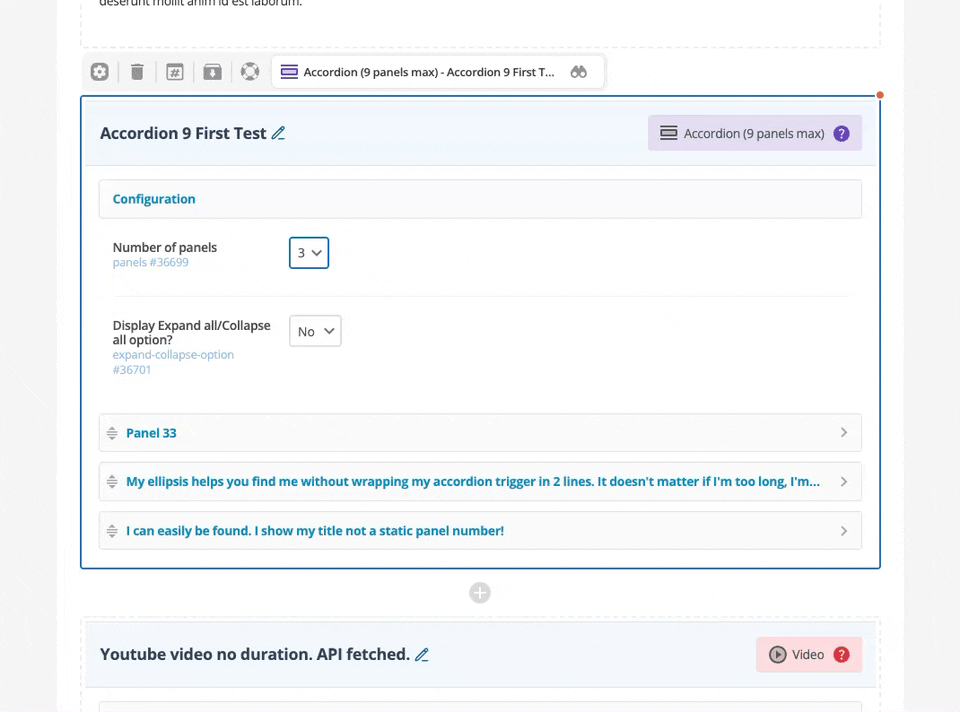

# Enhanced Custom Component Templates (CCTs)

## 📌 Overview

- **Matrix Version Agnostic:** Tested and fully compatible with Squiz Matrix versions 6.28 to 6.9.
- **Design System Independent:** Works seamlessly with any design system (the included examples use QGDS, but this is not a requirement).
- **Decoupled Enhancements:** Custom Edit Layouts, and Paint Layouts can be enhanced independently.
- **Flexible Rendering:** Supports Handlebars rendering out of the box, as well as custom-built HTML templates.

---

## 🛠️ Features

### 1. Publishing Tools

* **Drag-and-Drop Reordering:** Drag-and-drop sections to easily reorder cards, panels and tabs.
* **Hash Linking:** Hash links dynamically added to allow direct navigation to specific page sections.
* **Custom Slugs:** Custom unique CCT URLs (Custom Hash links).
* **Design Control:**  Add Custom CSS classes to manage individual CCT presentation.
* **Instant Preview:** One-click functionality to view CCT updates before publishing.
* **HTML rich select fields:** Search options in Select fields and customise option layout with HTML markups.
* **Input Validation:** Real-time popups on save to ensure all required fields are complete.

### 2. Improved Scannability

* **CCT labels:** Unique icons and colour-coding labels for faster identification.
* **Conditional visibility:** CCT form fields visibility progresses based on editor input.
* **Collapsible form sections** : Minimises editor screen length.
* **Custom component name** : Edit CCT name in page content and asset tree for faster identification.
* **Custom section titles:** Content hints at a glance, without needing to expand sections.
* **Hidden retired fields (SWE):** Visible with one click to maintain access to historical data.

### 3. Editor Support

* **Documentation:** High-visibility links to updated CCT documentation for quick reference.
* **Direct Assistance:** One-click support ticket creation with pre-filled description.

---

## 📦 Installation

The easiest way to install Enhanced CCTs is by using the provided XML package.

1. **Import the XML** file into your Squiz Matrix environment.
2. Aquire locks of the **QGDS Git Bridge asset and click *Clone repo*** `Enhanced CCT XML/Config/Site/QGDS Git Bridge`
3. Aquire locks of the **Enhanced CCTs Git Bridge asset and click *Clone repo*** `Enhanced CCT XML/Config/Enhanced CCTs/Enhanced CCTs Git Bridge`
4. Aquire locks of the **Site asset and assign a URL in the URLs screen** `Enhanced CCT XML/Site`

Once completed, the imported Site will be functional, and the 5 sample CCT examples provided in the XML will work on the Site homepage.

> 💡 **Note:** [Manual installation](./documentation/manual-installation.md) instructions are also available in the documentation if you prefer not to use the XML import method.

---

## 🚀 Integrating with Existing Site Assets

1. **Nest the Design Partial:** Nest `Enhanced CCT XML/Config/Enhanced CCTs/Enhanced CCT Design Partial` into your Site asset's active design customisation.
   *(Note: This step is optional and only required if you want to enhance Paint Layout rendering).*
2. **Build Components:** Follow the specific [Custom Edit Layout](./documentation/configuration-custom-edit-layout.md) and [Paint Layout](./documentation/configuration-paint-layout.md) instructions to start building your own Enhanced CCTs.

---

## 📄 Resources

- **Custom Edit Layout**
  - [Documentation](./documentation/configuration-custom-edit-layout.md)
  - [Chart](https://raw.githubusercontent.com/qld-gov-au/matrix-projects/refs/heads/enhanced-ccts/enhanced-ccts/documentation/assets/CCT-CELO.svg)
- **Paint Layout**
  - [Documentation](./documentation/configuration-paint-layout.md)
  - [Chart](https://raw.githubusercontent.com/qld-gov-au/matrix-projects/refs/heads/enhanced-ccts/enhanced-ccts/documentation/assets/CCT-PL.svg)

* [Manual Installation](./documentation/manual-installation.md)
* [Enhanced CCTs XML](./Enhanced-CCT-XML-V.1.0.1.tgz)
