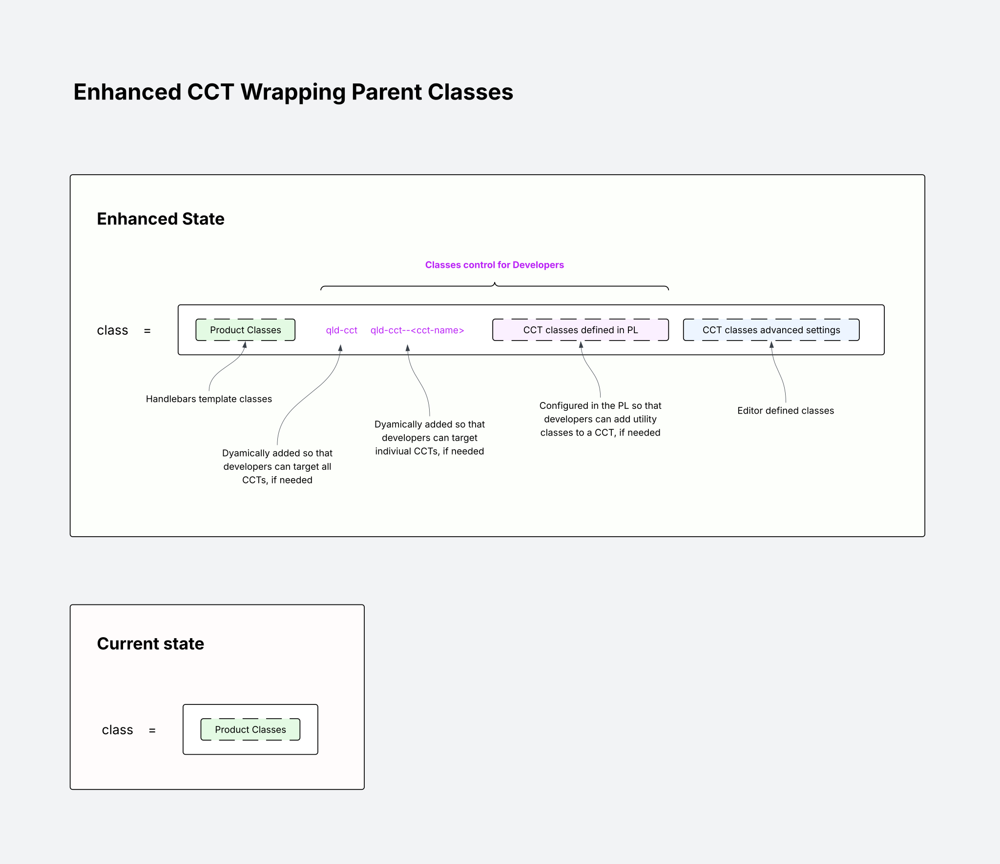
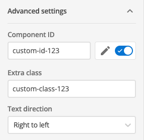
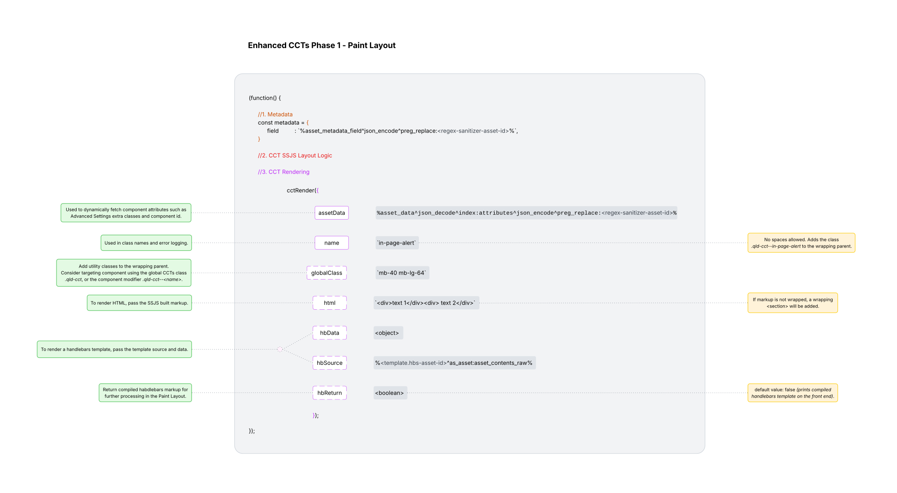

# **Paint Layout Configuration**

## **Features**

* **Dynamic HTML Wrapping:** Automatically evaluates the injected markup layout. If the raw HTML payload consists of multiple root-level elements, the engine dynamically wraps them inside a single `<section>` tag to guarantee DOM hierarchy stability.
* **Standardised CSS Cascading:** Enforces uniform styling rules across all components by maintaining strict control over the wrapping HTML parent output. HTML class attributes are injected in a sequential order to allow developers to safely override default product layouts, while giving editor final override authority:

  * Order of classes:

    * HB-template-classes
    * qld-cct
    * qld-cct-`<template-name>`
    * CCT-Paintlayout-global-classes
    * Admin-UI-dvanced-settings-classes

    
* **Parent Element Customisation:** Provides editors with control over the CCT parent element via the Admin UI, supporting the configuration of:

  * Custom Classes
  * Component IDs
  * Text Direction (`ltr` / `rtl`)

  
* **Separation of Concerns:** Establishes a clean architecture by decoupling backend data preparation from the visual CCT presentation layer.
* **Centralised Engine Stability:** Consolidates all Handlebars rendering pipeline operations to allow quick, platform-wide bug fixes from a single codebase context.

---

## **Implementation**

### Configuration object

* Call the `CCTRender({<configuration-object>})` function
* **JSON Schema:**

```json
{
  "$schema": "http://json-schema.org",
  "title": "CCT Render Configuration",
  "type": "object",
  "required": [
    "name"
  ],
  "additionalProperties": false,
  "properties": {
    "name": {
      "type": "string",
      "pattern": "^[^\\s]+$",
      "description": "Used in class names and error logging. No spaces allowed. Adds the class .qld-cct--in-page-alert to the wrapping parent."
    },
    "hbData": {
      "type": "object",
      "minProperties": 1,
      "description": "To render a handlebars template, pass the template source and data."
    },
    "hbSource": {
      "type": "string",
      "minLength": 1,
      "description": "To render a handlebars template, pass the template source and data."
    },
    "hbReturn": {
      "type": "boolean",
      "default": false,
      "description": "Return compiled handlebars markup for further processing in the Paint Layout. Default value: false (prints compiled handlebars template on the front end)."
    },
    "html": {
      "type": "string",
      "description": "To render HTML, pass the SSJS built markup. If markup is not wrapped, a wrapping <section> will be added."
    },
    "assetData": {
      "type": "string",
      "description": "Used to dynamically fetch component attributes such as Advanced Settings extra classes and component id."
    },
    "globalClass": {
      "type": "string",
      "description": "Add utility classes to the wrapping parent. Consider targeting component using the global CCTs class .qld-cct, or the component modifier .qld-cct--<name>."
    }
  },
  "dependencies": {
    "hbSource": ["hbData"]
  }
}
```



---

## **Technical Notes**

* **Use asset keywords over static IDs**
  Favour `%globals_asset_assetid:123%` over hardcoded ids like `123`. This ensures the CCT configuration survives XML exports and imports intact.
* **Fragment WYSIWYG fields**
  Split heavy WYSIWYG sections across multiple `<script runat="server">` tags. This bypasses Rhino engine processing limits and increases overall component capacity for editors.
* **Target components via CSS classes**
  Favour targeting components using the global CCT class `.qld-cct` or the specific component modifier `.qld-cct--<name>` instead of relying on utility classes in the `globalClass` key, where possible.
* **Rendering Options**

  * **HTML markup:** Pass the pre-built Server-Side JavaScript HTML markup directly via the `html` key.
  * **Handlebars templates:** Pass the template source into the `hbSource` key and the corresponding template data into the `hbData` key.
