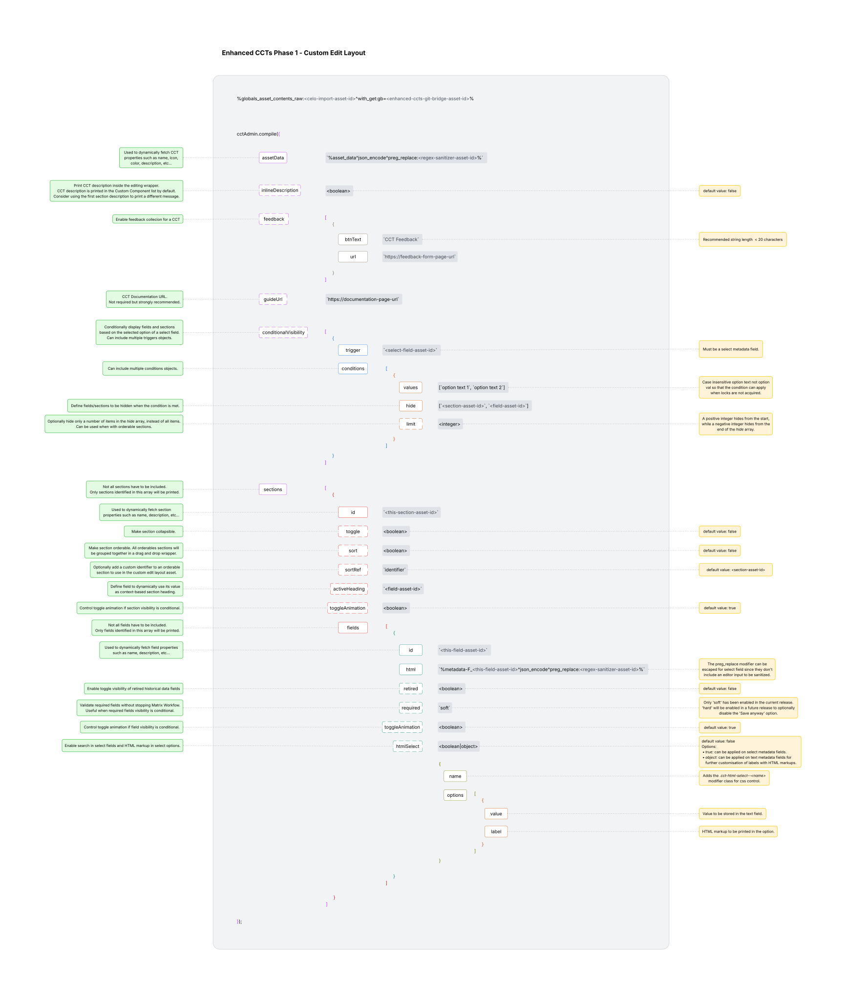

# **Custom Edit Layout Configuration**

## **Features**

* **Live Component Data**
  Fetches and utilises live data from the Matrix database, including:
  * CCT: `name`, `description`, `color`, and `icon`
  * Section: `name` and `description`
  * Field: `name`, `description`, `asset url`, and `metadata required state`
* **Configuration Options**
  * **Conditional Visibility:** Evaluates a trigger field value against criteria rules to programmatically toggle the visibility of specific fields or sections.
  * **Contextual Documentation:** Embeds documentation URL in the CCT.
  * **Integrated Feedback:** Enables CCT feedback collection inside the interface container.
  * **Collapsible Sections:** Provides accordion-style toggles to expand or collapse metadata sections as needed.
  * **Interactive Ordering:** Supports section drag-and-drop ordering.
  * **User-Defined Header Mapping:** Enables overriding default system strings with custom, contextual section titles.
  * **Retired Fields:** Hides retired metadata fields from the primary user interface layout without removing retired fields data.
  * **Pre-Save Validation:** Checks required field value on save without blocking the broader asset approval workflow.
  * **Rich HTML Select Fields:** Converts standard drop-down select fields into HTML-rich input interfaces with HTML markup label support.

---


## **Implementation**

### Configuration object

* Call the `cctAdmin({<configuration-object>})` function 
  **JSON Schema**
  ```JSON
  {
    "$schema": "http://json-schema.org",
    "title": "CCT Admin UI Configuration",
    "description": "Schema for CCT Admin UI configuration object",
    "type": "object",
    "required": [
      "assetData",
      "sections"
    ],
    "additionalProperties": false,
    "properties": {
      "assetData": {
        "type": "string",
        "description": "Live component data derived from the Matrix `%asset_data^json_encode^preg_replace:<regex-sanitizer-asset-id>%` keyword. Used to dynamically map component attributes such as name, icon, description, and accent color."
      },
      "inlineDescription": {
        "type": "boolean",
        "default": false,
        "description": "Prints CCT description inside the editing wrapper."
      },
      "feedback": {
        "type": "object",
        "description": "Configuration object to render the integrated feedback collection button.",
        "additionalProperties": false,
        "properties": {
          "btnText": {
            "type": "string",
            "description": "The visual text string visible to the editor."
          },
          "url": {
            "type": "string",
            "description": "Target URL opened in a new tab for user feedback submissions."
          }
        }
      },
      "guideUrl": {
        "type": "string",
        "description": "Documentation link embedded directly within the header space to provide content editors with one-click access to the component's guide page."
      },
      "conditionalVisibility": {
        "type": "array",
        "description": "Logic for hiding sections or fields based on select metadata fields values",
        "items": {
          "type": "object",
          "required": ["trigger", "conditions"],
          "additionalProperties": false,
          "properties": {
            "trigger": {
              "description": "Metadata field ID",
              "type": "string"
            },
            "conditions": {
              "type": "array",
              "items": {
                "type": "object",
                "required": ["values", "hide"],
                "additionalProperties": false,
                "properties": {
                  "values": {
                    "type": "array",
                    "items": {
                      "type": "string"
                    }
                  },
                  "limit": {
                    "type": "integer",
                    "description": "Optional numeric limit or offset for visibility logic. Can be negative to target the end of the array or positive to target the front."
                  },
                  "hide": {
                    "type": "array",
                    "description": "IDs to be hidden",
                    "items": {
                      "type": "string"
                    }
                  }
                }
              }
            }
          }
        }
      },
      "sections": {
        "type": "array",
        "description": "Collection of UI sections containing metadata fields",
        "items": {
          "type": "object",
          "required": [
            "id",
            "fields"
          ],
          "additionalProperties": false,
          "properties": {
            "id": {
              "type": "string",
              "description": "Asset id for the Metadata section."
            },
            "toggle": {
              "type": "boolean",
              "default": false,
              "description": "Determines if the section should render with in an accordion."
            },
            "sort": {
              "type": "boolean",
              "default": false,
              "description": "Determines if the section should be sortable. All sortable sections will be wrapped in one parent despite their order in the custom edit layout asset"
            },
            "sortRef": {
              "type": "string",
              "default": "<section-assetid>",
              "description": "Reference to be used in sort array in hidden metadata field to later be used in paint layout"
            },
            "activeHeading": {
              "type": "string",
              "description": "Asset id of the Metadata field that controls the section heading on the Admin interface"
            },
            "toggleAnimation": {
              "type": "boolean",
              "default": true,
              "description": "Determines if toggle animation should be enabled."
            },
            "fields": {
              "type": "array",
              "description": "List of metadata fields to be rendered within this section",
              "items": {
                "type": "object",
                "required": [
                  "id",
                  "html"
                ],
                "additionalProperties": false,
                "properties": {
                  "id": {
                    "type": "string",
                    "description": "Asset id for the Metadata field"
                  },
                  "html": {
                    "type": "string",
                    "description": "The Matrix metadata keyword (e.g., `%metadata-F_<this-field-asset-id>^json_encode^preg_replace:<regex-sanitizer-asset-id>%`)"
                  },
                  "retired": {
                    "type": "boolean",
                    "default": false,
                    "description": "Flags the field as retired. When true, hides the field from the active editing interface"
                  },
                  "required": {
                    "type": "boolean",
                    "default": false,
                    "description": "Checks required field value on save without blocking the broader asset approval workflow."
                  },
  			          "toggleAnimation": {
  			            "type": "boolean",
  			            "default": true,
  			            "description": "Determines if toggle animation should be enabled."
  			          },
                  "htmlSelect": {
                    "description": "Converts standard drop-down select fields into HTML-rich input interfaces with HTML markup label support. Set to true to produce HTML option labels from Matrix select field options, or define options to control HTML markup and store value in a Matrix text field.",
                    "default": false,
                    "anyOf": [
                      {
                        "type": "boolean"
                      },
                      {
                        "type": "array",
                        "items": {
                          "type": "object",
                          "required": [
                            "name",
                            "options"
                          ],
                          "additionalProperties": false,
                          "properties": {
                            "name": {
                              "type": "string",
                              "description": "Label identifying the distinct drop-down group."
                            },
                            "options": {
                              "type": "array",
                              "description": "Array of selectable key-value option pairs available within this list.",
                              "items": {
                                "type": "object",
                                "required": [
                                  "label",
                                  "value"
                                ],
                                "additionalProperties": false,
                                "properties": {
                                  "label": {
                                    "type": "string",
                                    "description": "The HTML markup block displayed within the select option row interface."
                                  },
                                  "value": {
                                    "type": "string",
                                    "description": "The value string saved when this specific option is selected."
                                  }
                                }
                              }
                            }
                          }
                        }
                      }
                    ]
                  }
                }
              }
            }
          }
        }
      }
    }
  }
  ```



---


## **Technical Notes**

* **Use asset keywords over static IDs**
  Favour `%globals_asset_assetid:123%` over hardcoded ids like `123`. This ensures the CCT configuration survives XML exports and imports intact.
* **Fragment WYSIWYG fields**
  Split heavy WYSIWYG sections across multiple `<script runat="server">` tags. This bypasses Rhino engine processing limits and increases overall component capacity for editors.
* **Inline Component Descriptions**

  * The CCT description prints in the Custom Component list by default. Use the `inlineDescription`key to print the CCT description inside the editing wrapper.
  * Consider using the first section description to print a different, context-specific message at the begging of the component.
* **Multiple Component Feedback**
  If multiple CCTs are released together with a unified CTA button text and feedback URL, define an array outside of the custom edit layouts. Reference this array across all targeted CCTs to simplify maintenance. For example, `%globals_asset_contents_raw:<page-hosting-test-object-assetid>%`
* **Conditional Visibility Rules**

  * **Trigger:** Must be configured as a Select field.
  * **Values:** Use case-insensitive option text that is visible in the select dropdown or printed when locks are not acquired. Do not use the option value stored in the metadata. This ensures the conditional visibility rules still apply even when locks are released.
  * **Limit:** Optionally hide only a specific number of items defined in the `hide` array, instead of hiding all items. This is particularly useful for orderable sections where the frontend display order is unknown for sections.
* **Orderable CCT Sections**
  When configuring CCTs with orderable sections, the specific control section below must be included in the CCT metadata schema. You do not need to print this section on the frontend. The Enhanced CCT scripts read this section by name to save the editor's custom sorting preferences in the component metadata.

  * **Section Name:** `CCT Control`
  * **Fields:** `cct-control.section_sort`
* **Section Heading**
  Section names have their trailing delimiters and numbers stripped in the Admin UI. For example, `Panel-2`, `Panel - 2`, or `Panel2` section headings will all become `Panel`.
* **Rich HTML Select Field Configuration Options**

  * Option 1: Native Select Field

    * **Value:** `true`
    * **Metadata Field Type:** Select field
    * **Use Case:** Use this when dealing with a large number of options to natively enable the search functionality.
  * Option 2: Text-Backed Custom Field

    * **Value:** Object with predefined options containing `value` and `label`.
    * **Metadata Field Type:** Text field (rendered as a select field. The selected option value will be stored in the text field).
    * **Use Case:** Use this option when further customisation of labels using HTML markups is needed.
